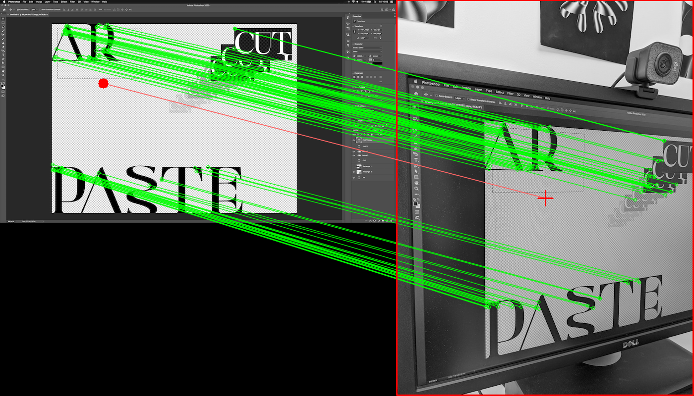

# ScreenPoint

Finds the (x,y) coordinates of the centroid of an image (eg: a mobile phone camera image) pointing at another image (eg: a computer screen) using feature matching algorithms ([ORB](https://docs.opencv.org/3.4/d1/d89/tutorial_py_orb.html) or [SIFT](https://docs.opencv.org/2.4/modules/nonfree/doc/feature_detection.html)).



## Installation

```bash
pip install screenpoint
```

## Usage

```python
import screenpoint
import cv2

# Load input images.
screen = cv2.imread('screen.png', 0)
view = cv2.imread('view.jpg', 0)

# Project view centroid to screen space (uses ORB by default for speed).
# x and y are the coordinate of the `view` centroid in `screen` space.
x, y = screenpoint.project(view, screen)

# For more robustness at the cost of speed, use SIFT:
x, y = screenpoint.project(view, screen, algorithm='sift')

# Get debug visualization:
x, y, debug_img = screenpoint.project(view, screen, debug=True)
```

### Algorithm Comparison

- **ORB (default)**: 10-100x faster, good for real-time applications (30-60 FPS possible)
- **SIFT**: More robust to blur and extreme transformations, slower (2-20 FPS typical)

See [example.py](example.py) for more information.
